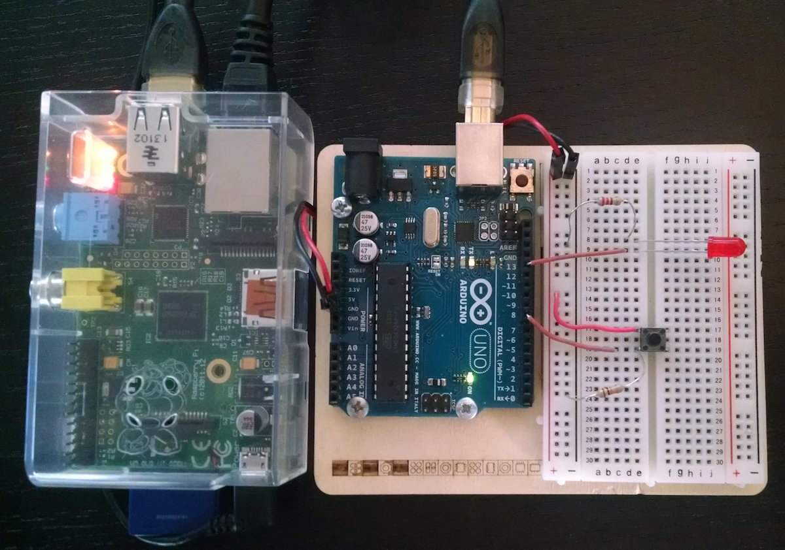
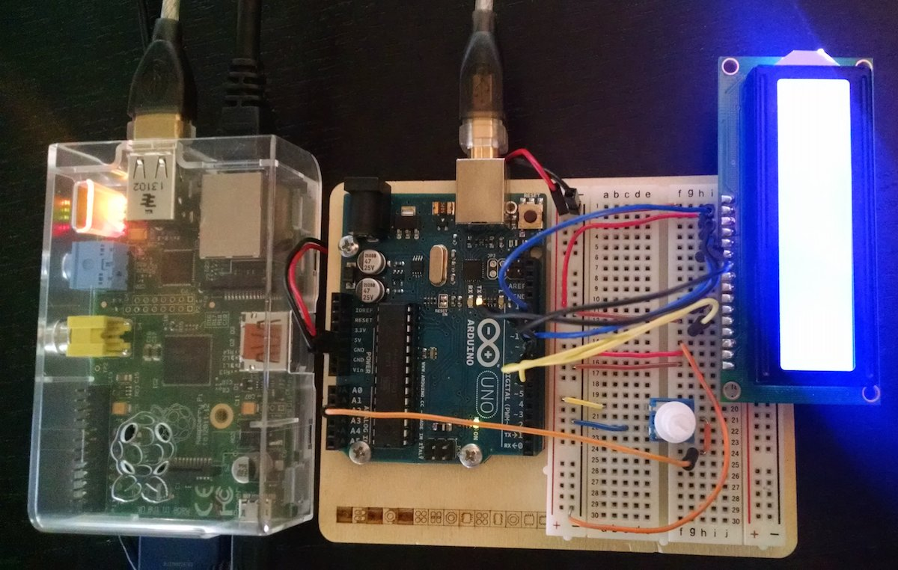
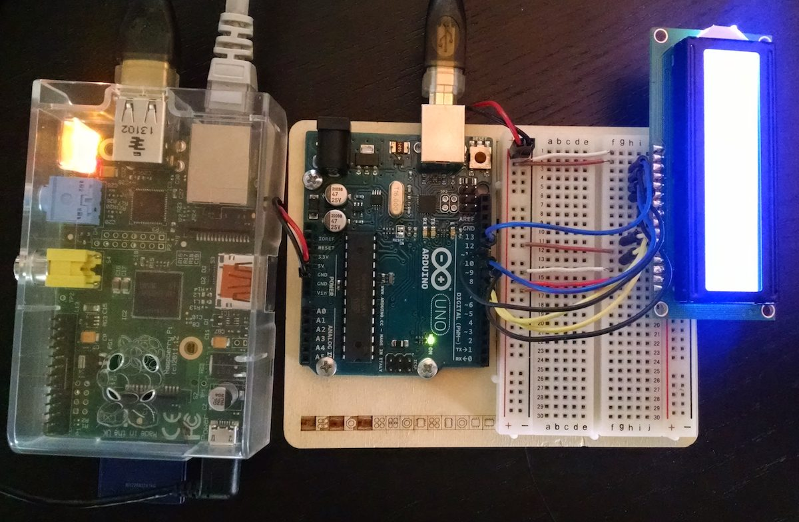

# Firebase + Raspberry Pi + Arduino + Node.js
A few JavaScript examples that integrate a Firebase with the physical world.

(I guess this would make this an IoT / Internet of Things example.)

## Physical stuff you need
These examples probably work with other boards, but they were written with two things you probably have lying around somewhere. Go dig them up and blow the dust off of them.

- Raspberry pi
- Arduino Uno
- Some basic parts (that come with the [Arduino Uno starter kit](http://arduino.cc/en/Main/ArduinoStarterKit))
    - Push button
    - LED
    - Potentiometer
    - 16x2 LCD

## Soft dependencies

- [Firebase](https://www.firebase.com/) - realtime platform; the Internet part of this example
- [Johnny Five](https://github.com/rwaldron/johnny-five#user-content-setup-and-assemble-arduino) - open source JavaScript Arduino programming framework

## What's here
This project contains three tiny examples, each in their own JavaScript file:

### button-led.js

Press a button and see an LED turn on. It's the cliché Hello World of electronics, except synchronized in real time with Firebase. If you run it on many devices at once, the LED comes on when anyone presses the button.

### potentiometer-lcd.js

Turn a potentiometer and see a number change on an LCD. You can also see the number update in your [Firebase dashbaord](https://www.firebase.com/account/#/).

### bitcoin-price-lcd.js

Display the current Bitcoin price on an LCD. This uses the [Firebase cryptocurrency open data set](https://www.firebase.com/docs/open-data/cryptocurrencies.html).

## Running it
0. Wire up your components to match the sample you'd like to run. You can use the picture above as a guide, but it's probably easier to read the pin assignments in the code comments.
0. Install the `StandardFirmata` sketch to your Arduino per the [Johnny Five documentation](https://github.com/rwaldron/johnny-five#user-content-setup-and-assemble-arduino).
0. Install [node.js](http://nodejs.org/), [Johnny Five](https://github.com/rwaldron/johnny-five#user-content-hey-you-heres-johnny) and [Firebase's node.js client](https://www.firebase.com/docs/web/quickstart.html) onto your Raspberry Pi.
0. If you're running `button-led.js` or `potentiometer-lcd.js`, create a new [Firebase](https://www.firebase.com/) to store/synchronize your state. Replace `YOUR_FIREBASE` in the code with the subdomain for your Firebase.
0. Copy the JavaScript code on to your Raspberry Pi.
0. Run it:

        $ node btc-lcd.js